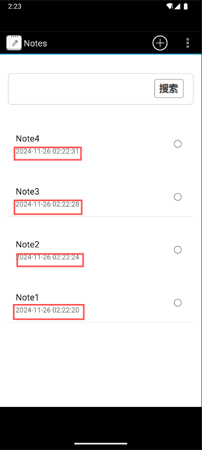
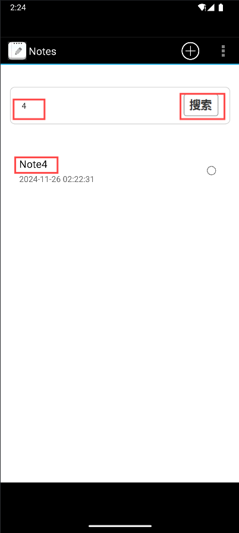
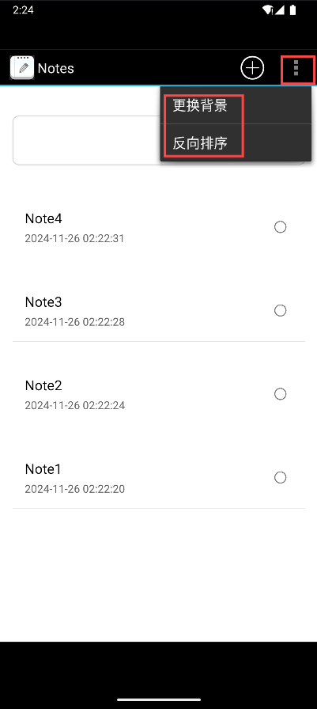
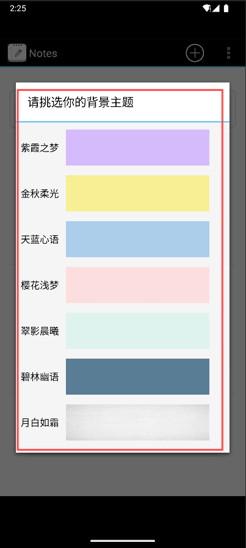
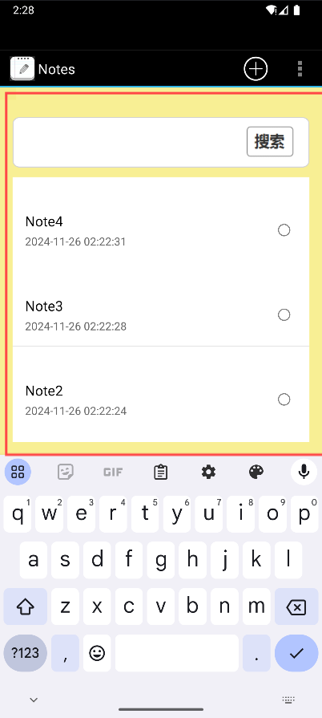
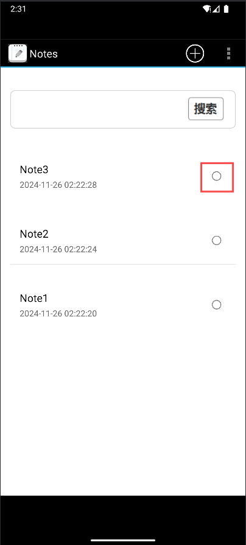
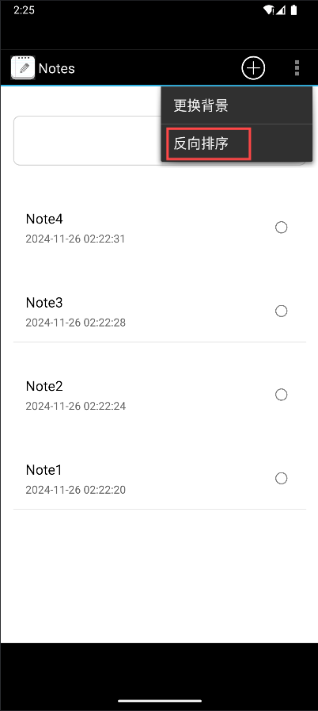
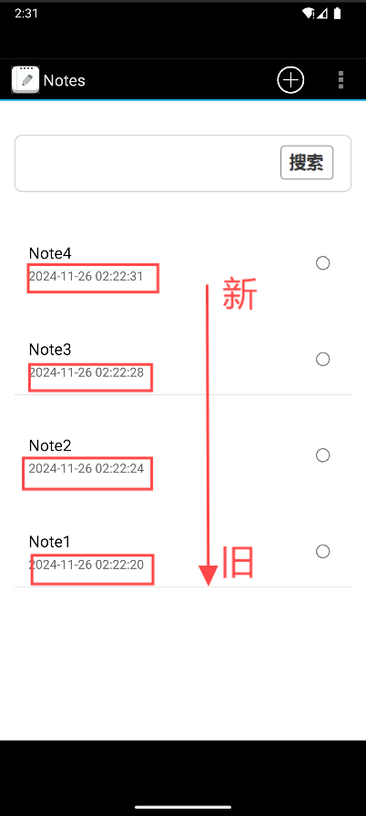
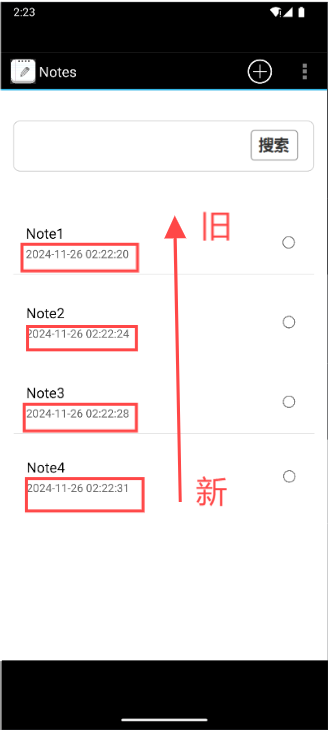

# Android Notepad 项目文档

## 一、项目概述

这是一个 Android 笔记应用（Notepad），旨在为用户提供一个简洁、易用的记事工具。项目基于基础的笔记管理功能（如创建、编辑、删除笔记），并在此基础上进行了拓展和优化。目标是提高用户体验和提升功能的多样性。

### 基础功能
1.笔记条目时间戳显示 2.笔记查询

### 拓展功能
1.UI美化（更换背景） 2.排序功能 3.代办功能

## 二、功能描述

### 1. **笔记条目增加时间戳显示**
在 **NoteList** 界面，每一条笔记都会显示一个时间戳，表示笔记的创建时间。用户可以通过这个时间戳判断笔记的添加顺序。

- **实现方式**：使用当前系统时间（`System.currentTimeMillis()`）作为笔记的创建时间戳，并将其保存到数据库中。
- **展示效果**：时间戳会以格式化后的日期时间（如 `2024-11-26 14:30:33`）展示在笔记条目旁。
- **关键代码**：
```java
public static String StringToDate(String str_data)
    {
        String beginDate=str_data;
        SimpleDateFormat sdf=new SimpleDateFormat("yyyy-MM-dd HH:mm:ss");
        String sd = sdf.format(new Date(Long.parseLong(beginDate)));
        return  sd;
    }
```
### 笔记列表界面
- 显示所有笔记的标题、内容摘要和创建时间（时间戳）。
- **截图展示**：  
  

### 2. **笔记查询功能**
用户可以通过标题或内容对笔记进行模糊查询，快速找到需要的笔记。

- **实现方式**：在数据库中使用 `LIKE` 查询语句，分别对笔记的标题和内容进行匹配，支持模糊搜索。
- **查询界面**：在笔记列表页面顶部添加一个搜索框，用户输入查询内容后，会实时更新显示符合条件的笔记条目。
- **关键代码**：
```java
public static String StringToDate(String str_data)
    {
        String beginDate=str_data;
        SimpleDateFormat sdf=new SimpleDateFormat("yyyy-MM-dd HH:mm:ss");
        String sd = sdf.format(new Date(Long.parseLong(beginDate)));
        return  sd;
    }
```
### 笔记查询
- 在笔记列表页面，用户可以通过搜索框输入查询条件，点击搜索过滤符合条件的笔记。
- **截图展示**：  
  


### 3. **UI 美化**
在基础界面的设计上进行了美化，使用简易的黑白默认风格，改进了用户体验。

- **实现方式**：
    - 更改了记事本的默认背景颜色，采用更为黑白的简单的颜色搭配。
    - 更新了按钮样式，增加了阴影和圆角效果，使界面更加现代化。
    - 改善了字体和布局，使信息展示更为清晰。
### UI美化（更换背景功能）
- 可以进行背景的更换来对笔记进行美化，同时可以有多种背景进行选择更换
- **截图展示**：  
  
  
  


### 4. **代办功能**
用户可以标记笔记为代办事项，或者直接删除某些笔记。

- **实现方式**：每个笔记都有匹配一个代办属性，点击删除代办的对应按钮能删除某篇笔记
- **功能实现**：
    - 在每条笔记旁增加一个代办按钮来进行删除笔记
### 代办功能
- 每条笔记都有一个代办按钮，用户可以完成某条笔记。
- **截图展示**：  
  


### 5. **反向排序**
笔记列表会根据时间戳进行反向排序，之前创建的笔记显示在最上面。

- **实现方式**：查询笔记时，按照时间戳进行降序排序。
- **展示效果**：用户能够看到原先的笔记始终在列表的顶部，而新的笔记则排在下面。

### 重新排序功能
- 默认的笔记排序方式是根据时间来进行排序，最新创建的笔记在最上面，我们可以对笔记进行反向排序
- **截图展示**：  
  
  
  

---

## 三、技术栈

- **编程语言**: Java
- **开发环境**: Android Studio
- **数据库**: SQLite
- **界面设计**: XML 布局文件
- **依赖库**:
    - RecyclerView: 用于展示笔记列表。
    - SQLite: 用于存储和查询笔记数据。

